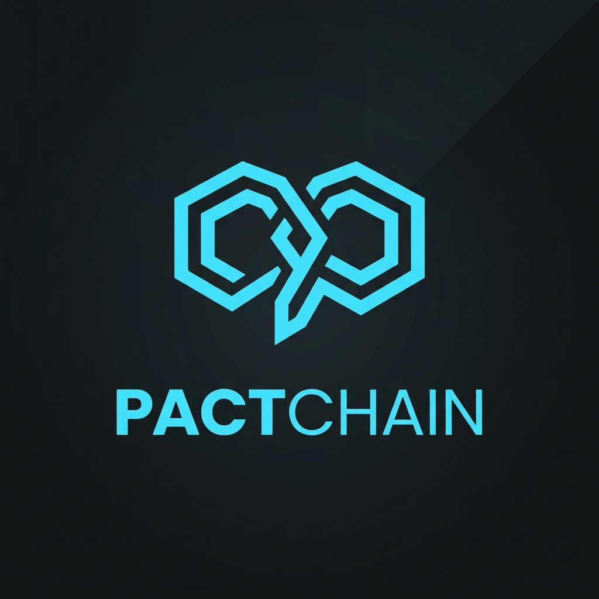
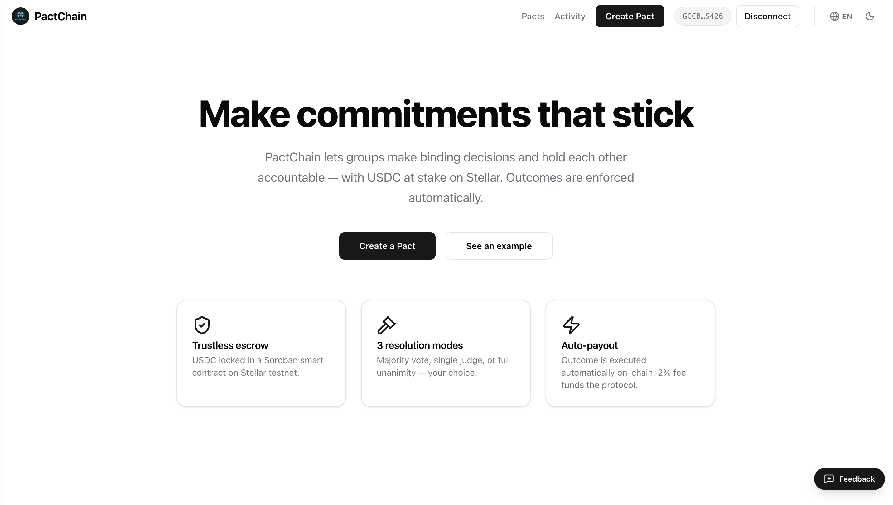
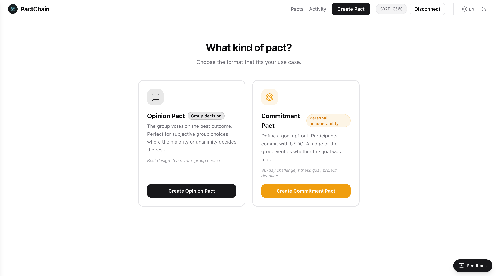
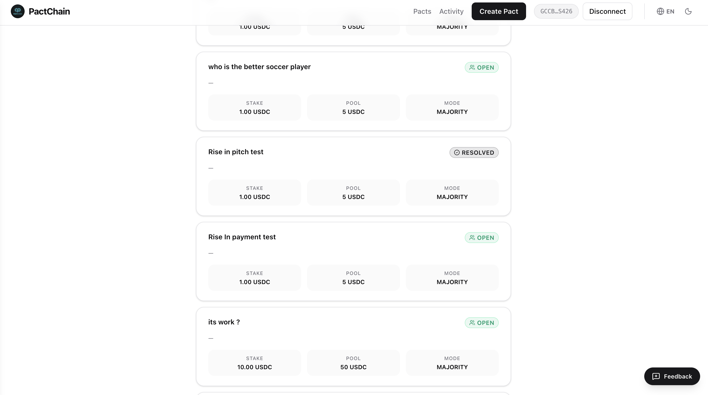

<div align="center">
  
</div>


# PactChain

> **Social commitments with real consequences.**

PactChain is a social accountability dApp on Stellar where groups create binding pacts, lock USDC in a Soroban smart contract, and resolve outcomes by vote or judge ruling. Only winners claim their reward. Losers lose their stake. No middleman. No refunds for quitters.

[](https://pactchain.vercel.app)
[](https://stellar.expert/explorer/testnet)
[](https://github.com/jorgesoares2997/pact-chain)

---

## Problem Statement

Informal social commitments lack enforcement. Handshake deals fail because there's no neutral escrow. PactChain replaces trust with cryptographic guarantees — USDC is locked in a Soroban smart contract and only released to those who were right.

---

## Pact Types

### Opinion Pact
A group prediction or debate. Participants stake USDC and vote on any outcome they define (e.g. "Will ETH hit $5k before July?"). Voters on the winning side **claim** the pool proportionally. Losers' stakes go to the winners — no refunds.

### Commitment Pact
A personal accountability contract. One person commits to a goal (e.g. "I will ship this feature by Friday"), sets success criteria and evidence requirements. A judge rules on the outcome. Creator collects the pool on success; witnesses split it on failure.

---

## Live Demo

🌐 **Frontend:** https://pactchain.vercel.app  
📄 **Contract WASM Hash:** `659d3762eb592800b267353f0f040730df1781c5b6525a9b8f6259d216120ee0`  
🔗 **Network:** Stellar Testnet · Token: Circle testnet USDC (`CBIELTK6YBZJU5UP2WWQEUCYKLPU6AUNZ2BQ4WWFEIE3USCIHMXQDAMA`)  
📹 **Demo Video:** [Watch on YouTube](https://youtu.be/QbG9xFKww4E)

---

## Architecture

```
┌──────────────────────────────────────────────────────────┐
│  Next.js 16 + Tailwind CSS v4 (Vercel)                  │
│  next-intl (EN/PT) · Stellar Wallets Kit v2.4           │
│  Freighter · LOBSTR · xBull · CactusLink · WalletConnect│
└────────────────────────┬─────────────────────────────────┘
                         │ REST API
┌────────────────────────▼─────────────────────────────────┐
│  Spring Boot 3 + Java 21 (Render)                       │
│  PostgreSQL via Supabase · Liquibase migrations         │
│  Sentry error tracking · Full audit log                 │
└────────────────────────┬─────────────────────────────────┘
                         │ Stellar RPC
┌────────────────────────▼─────────────────────────────────┐
│  Soroban Smart Contract — Stellar Testnet               │
│  Rust + Soroban SDK 21 · USDC escrow · Pull-based claim │
└──────────────────────────────────────────────────────────┘
```

---

## Tech Stack

| Layer | Technology |
|---|---|
| Smart Contract | Rust · Soroban SDK 21 · Stellar Testnet |
| Frontend | Next.js 16 · Tailwind CSS v4 · TypeScript |
| Wallet Integration | @creit.tech/stellar-wallets-kit v2.4 (Freighter, LOBSTR, xBull, CactusLink, WalletConnect) |
| i18n | next-intl (English + Portuguese) |
| Backend | Spring Boot 3 · Java 21 · Spring Data JPA |
| Database | PostgreSQL via Supabase |
| Migrations | Liquibase |
| Error Tracking | Sentry |
| Hosting | Vercel (frontend) · Render (backend) |
| Analytics | Plausible (privacy-first) |

---

## Smart Contract

One contract instance is deployed per pact from an uploaded WASM. Key entrypoints:

| Function | Who calls it | What it does |
|---|---|---|
| `initialize` | Creator | Deploys pact state, auto-joins creator |
| `join` | Any wallet | Stakes USDC on-chain |
| `vote` | Participants | Records vote for an option index |
| `resolve` | Anyone (post-deadline) | Tallies votes, marks winner — no USDC moves yet |
| `claim` | Winners only | Each winner pulls their share individually |
| `refund` | Anyone (draw) | Refunds all participants on no-consensus |
| `judge_resolve` | Judge | Immediate push payout (judge mode only) |

### Resolution Modes

| Mode | How it resolves |
|---|---|
| **Majority** | Option with >50% of votes wins |
| **Unanimity** | All participants must vote the same option |
| **Judge** | Designated judge picks the winning side — immediate payout |

### Pull-based Claim Mechanic

`resolve()` only marks the pact as RESOLVED and identifies the winning option — **no USDC is transferred**. Each winner then calls `claim()` individually to pull their share. Losers can never call `claim()`. This eliminates the treasury trustline bottleneck from push-based payouts and makes the mechanic explicit: you earn your reward, you claim it.

### Fee Model

- 2% of the total pool goes to the protocol treasury
- For majority/unanimity: fee is split proportionally across all `claim()` calls
- For judge mode: fee is sent atomically at resolution

---

## Multi-Wallet Support

PactChain uses `@creit.tech/stellar-wallets-kit` v2.4 to support all major Stellar wallets via a unified wallet picker modal:

| Wallet | Desktop | Mobile |
|---|---|---|
| Freighter | Browser extension | — |
| LOBSTR | Browser extension | Deep link |
| xBull | Browser extension | Deep link |
| CactusLink | Browser extension | Deep link |
| WalletConnect | QR code | Deep link (requires Reown project ID) |

---

## User Onboarding

Real user interactions are recorded on-chain and in the backend audit log. The `/activity` page shows the live public feed.

| Action | Trigger |
|---|---|
| `pact_created` | Creator deploys contract + saves pact |
| `joined_pact` | Participant joins via invite link, stakes USDC on-chain |
| `voted` | Participant casts signed vote on-chain |
| `pact_won` | Winner claims reward |
| `pact_refunded` | Draw — participant claims refund |

User feedback is collected via Google Form accessible from every pact page. 10+ users onboarded with wallet interactions recorded on-chain.

📋 **Feedback responses:** [View Google Sheets](https://docs.google.com/spreadsheets/d/1kQZiA4avMyT7Cb_YZYtF3dZGBk7clRBcfu8hK-GebsQ/edit?usp=sharing)

---

## Production Quality

- **Mobile responsive** — Tailwind CSS v4 with fluid layouts tested on mobile viewports
- **Loading states** — every async action (join, vote, resolve, claim) has spinner + step labels
- **Error handling** — all Soroban errors translated to readable toasts (no raw HostError strings shown to users)
- **Monitoring** — Sentry error tracking on backend; Plausible analytics on frontend
- **Internationalization** — English and Portuguese via next-intl
- **Audit trail** — every wallet interaction is logged with timestamp, wallet address, pact context, and on-chain tx reference

---

## Local Development

### Prerequisites

- Node.js 20+ · npm or pnpm
- Java 21 · Maven 3.9+
- Rust + `cargo`
- Stellar CLI — `cargo install --locked stellar-cli --features opt`
- Any supported Stellar wallet (Freighter recommended for desktop dev)
- USDC trustline on your testnet wallet (`GBBD47IF6LWK7P7MDEVSCWR7DPUWV3NY3DTQEVFL4NAT4AQH3ZLLFLA5`)

### 1. Smart Contract (already deployed — skip unless changing)

```bash
cd contract
cargo build --target wasm32-unknown-unknown --release
stellar contract optimize --wasm target/wasm32-unknown-unknown/release/pactchain.wasm
stellar contract upload \
  --wasm target/wasm32-unknown-unknown/release/pactchain.optimized.wasm \
  --network testnet \
  --source YOUR_KEY_NAME
# Copy the returned hex hash → NEXT_PUBLIC_CONTRACT_WASM_HASH
```

### 2. Backend

```bash
cd backend
./mvnw spring-boot:run
# API → http://localhost:8080
# H2 console → http://localhost:8080/h2-console (dev only)
```

### 3. Frontend

```bash
cd frontend
cp .env.example .env   # fill in values
npm install
npm run dev            # → http://localhost:3000
```

---

## Environment Variables

### Frontend (`frontend/.env`)

```env
NEXT_PUBLIC_API_URL=http://localhost:8080
NEXT_PUBLIC_STELLAR_RPC_URL=https://soroban-testnet.stellar.org
NEXT_PUBLIC_CONTRACT_WASM_HASH=659d3762eb592800b267353f0f040730df1781c5b6525a9b8f6259d216120ee0
NEXT_PUBLIC_USDC_TOKEN_ID=CBIELTK6YBZJU5UP2WWQEUCYKLPU6AUNZ2BQ4WWFEIE3USCIHMXQDAMA
NEXT_PUBLIC_TREASURY_ADDRESS=<your Stellar G... address with USDC trustline>
NEXT_PUBLIC_WALLETCONNECT_PROJECT_ID=   # optional — enables mobile deep links
NEXT_PUBLIC_SENTRY_DSN=
NEXT_PUBLIC_PLAUSIBLE_DOMAIN=
```

> ⚠️ The treasury address **must have a USDC trustline** on testnet or all payouts will fail.  
> Add one via [Stellar Laboratory](https://laboratory.stellar.org) with asset `USDC` / issuer `GBBD47IF6LWK7P7MDEVSCWR7DPUWV3NY3DTQEVFL4NAT4AQH3ZLLFLA5`.

### Backend (env or `application.properties`)

```env
DATABASE_URL=jdbc:postgresql://<host>:5432/postgres
DB_DRIVER=org.postgresql.Driver
DB_USER=postgres
DB_PASS=<password>
FRONTEND_URL=https://pactchain.vercel.app
PORT=8080
```

---

## Database Schema

| Table | Purpose |
|---|---|
| `pacts` | Pact metadata — type, criteria, resolution mode, deadline, status, winner |
| `pact_participants` | On-chain verified participants with stake amount and tx hash |
| `wallet_interactions` | Full audit log of every user action with timestamp and wallet address |
| `pact_votes` | Structured vote records for tally display |
| `pact_results` | Per-option vote counts used for resolution preview |
| `invite_links` | Short-code invite URLs for sharing |

---

## 📸 Prints, vídeo, deploy ou exemplos de uso
- **Deploy:** [https://pact-chain.vercel.app/](https://pact-chain.vercel.app/)

> *Screenshots da aplicação*

### Home Page


### Pacts Choice Page


### Pact Show Page



## Repository Structure

```
pact-chain/
├── contract/          # Rust Soroban smart contract
│   └── src/lib.rs     # Full contract: initialize, join, vote, resolve, claim, refund
├── backend/           # Spring Boot REST API
│   └── src/main/java/com/pactchain/
│       ├── controller/    # Pact, Interaction, Invite endpoints
│       ├── service/       # Business logic
│       └── repository/    # JPA queries
├── frontend/          # Next.js app
│   └── src/
│       ├── app/[locale]/  # Pages: home, pacts, create, pact/[id], vote, activity
│       ├── lib/           # stellar.ts (contract calls), api.ts (backend calls)
│       ├── components/    # UI primitives
│       └── context/       # WalletContext
├── PITCH_1MIN.md      # 1-minute screen recording pitch script
└── VIDEO_GUIDE.md     # Full teleprompter demo script
```

---

## License

MIT
